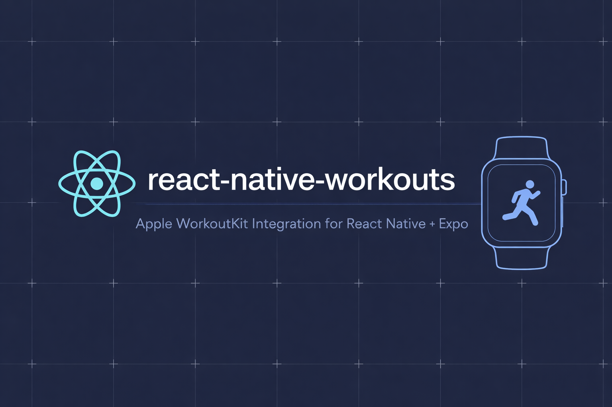

# react-native-workouts

🏋️‍♀️ React Native Expo module for Apple WorkoutKit — create, preview, and sync
workouts to Apple Watch.

## Features

- ✨ Create custom interval workouts (warmup, blocks, cooldown, alerts)
- 🎯 Create single-goal workouts (distance / time / energy)
- 🏃‍♂️ Create pacer workouts (pace / speed targets)
- 🧩 Create multisport Swim / Bike / Run workouts
- 👀 Preview with Apple’s system UI (includes “Add to Watch” / “Send to Watch”)
- ⌚️ Schedule & sync to the Apple Watch Workout app
- 🧠 Hooks-first API + stateful `WorkoutPlan` handle (Expo Shared Object)
- ✅ Full TypeScript support

## Requirements

- iOS 17.0+ **at runtime** (WorkoutKit)
- Tested with Expo SDK 54+
- Apple Watch paired with iPhone (for workout sync)

## Installation

```bash
npm install react-native-workouts
# or
yarn add react-native-workouts
# or
pnpm add react-native-workouts
```

### Info.plist Configuration

Add the following keys to your Info.plist for HealthKit access:

```xml
<key>NSHealthShareUsageDescription</key>
<string>This app needs access to health data to sync workouts.</string>
<key>NSHealthUpdateUsageDescription</key>
<string>This app needs to write workout data.</string>
```

## Usage

### 🔐 Authorization (hook)

Before previewing/scheduling, request authorization (HealthKit / WorkoutKit):

```typescript
import { useWorkoutAuthorization } from "react-native-workouts";

export function MyScreen() {
  const { status, request, isLoading, error } = useWorkoutAuthorization();

  // status: 'authorized' | 'notDetermined' | 'denied' | 'unknown' | null
  // request(): prompts the system dialog (if needed) and returns the new status

  return null;
}
```

### 🚀 Quick start (hooks-first `WorkoutPlan`)

Hooks create a **stateful `WorkoutPlan` shared object** (Expo Shared Object).
You call methods on the plan:

- `plan.preview()` — opens Apple’s workout preview UI (includes “Add/Send to
  Watch”)
- `plan.scheduleAndSync(date)` — schedules using Apple’s `WorkoutScheduler`
  (this is what syncs it to the Watch)
- `plan.export()` — returns `{ id, kind, config }` so you can persist/share and
  recreate later

```typescript
import { useMemo } from "react";
import {
  type CustomWorkoutConfig,
  useCustomWorkout,
  useWorkoutAuthorization,
} from "react-native-workouts";

export function MyWorkoutScreen() {
  const { status, request } = useWorkoutAuthorization();

  const config = useMemo<CustomWorkoutConfig>(
    () => ({
      activityType: "running",
      locationType: "outdoor",
      displayName: "Morning Intervals",
      warmup: { goal: { type: "time", value: 5, unit: "minutes" } },
      blocks: [
        {
          iterations: 4,
          steps: [
            {
              purpose: "work",
              goal: { type: "distance", value: 400, unit: "meters" },
              alert: { type: "pace", min: 4, max: 5, unit: "min/km" },
            },
            {
              purpose: "recovery",
              goal: { type: "time", value: 90, unit: "seconds" },
            },
          ],
        },
      ],
      cooldown: { goal: { type: "time", value: 5, unit: "minutes" } },
    }),
    [],
  );

  const { plan, isLoading, error } = useCustomWorkout(config);

  const preview = async () => {
    if (!plan) return;
    if (status !== "authorized") await request();
    await plan.preview();
  };

  const scheduleTomorrowMorning = async () => {
    if (!plan) return;
    if (status !== "authorized") await request();
    await plan.scheduleAndSync({
      year: 2026,
      month: 1,
      day: 12,
      hour: 7,
      minute: 0,
    });
  };

  return null;
}
```

### 🎯 Single goal workouts (hook)

```typescript
import { useMemo } from "react";
import type { SingleGoalWorkoutConfig } from "react-native-workouts";
import { useSingleGoalWorkout } from "react-native-workouts";

export function FiveKScreen() {
  const config = useMemo<SingleGoalWorkoutConfig>(
    () => ({
      activityType: "running",
      locationType: "outdoor",
      displayName: "5K Run",
      goal: { type: "distance", value: 5, unit: "kilometers" },
    }),
    [],
  );

  const { plan } = useSingleGoalWorkout(config);
  return null;
}
```

### 🏃‍♂️ Pacer workouts (hook)

```typescript
import { useMemo } from "react";
import type { PacerWorkoutConfig } from "react-native-workouts";
import { usePacerWorkout } from "react-native-workouts";

export function TempoRunScreen() {
  const config = useMemo<PacerWorkoutConfig>(
    () => ({
      activityType: "running",
      locationType: "outdoor",
      displayName: "Tempo Run",
      target: { type: "pace", value: 5, unit: "min/km" },
    }),
    [],
  );

  const { plan } = usePacerWorkout(config);
  return null;
}
```

### 🧩 Swim / Bike / Run (multisport) (hook)

```typescript
import { useMemo } from "react";
import type { SwimBikeRunWorkoutConfig } from "react-native-workouts";
import { useSwimBikeRunWorkout } from "react-native-workouts";

export function TriathlonScreen() {
  const config = useMemo<SwimBikeRunWorkoutConfig>(
    () => ({
      displayName: "Sprint Triathlon",
      activities: [
        { type: "swimming", locationType: "indoor" },
        { type: "cycling", locationType: "outdoor" },
        { type: "running", locationType: "outdoor" },
      ],
    }),
    [],
  );

  const { plan } = useSwimBikeRunWorkout(config);
  return null;
}
```

### 📦 Persist / share a plan (`plan.export()`)

`plan.export()` does **not** export a `.workout` file.

It returns a small JSON payload you can store in your backend and later
recreate:

- `id`: UUID of the `WorkoutPlan` instance
- `kind`: `"custom" | "singleGoal" | "pacer" | "swimBikeRun"`
- `config`: the original config used to create the plan

### 📅 Managing scheduled workouts (hook)

```typescript
import { useScheduledWorkouts } from "react-native-workouts";

export function ScheduledWorkoutsScreen() {
  const { workouts, remove, removeAll, schedule, isLoading, error } =
    useScheduledWorkouts();

  // schedule(plan, date) calls plan.scheduleAndSync(date) and reloads the list
  return null;
}
```

## API Reference

### Types

#### Activity Types

```typescript
type ActivityType =
  | "running"
  | "cycling"
  | "walking"
  | "hiking"
  | "swimming"
  | "rowing"
  | "elliptical"
  | "stairClimbing"
  | "highIntensityIntervalTraining"
  | "yoga"
  | "functionalStrengthTraining"
  | "traditionalStrengthTraining"
  | "dance"
  | "jumpRope"
  | "coreTraining"
  | "pilates"
  | "kickboxing"
  | "stairs"
  | "stepTraining"
  | "wheelchairRunPace"
  | "wheelchairWalkPace";
```

#### Goal Types

```typescript
type WorkoutGoal =
  | { type: "open" }
  | { type: "distance"; value: number; unit?: DistanceUnit }
  | { type: "time"; value: number; unit?: TimeUnit }
  | { type: "energy"; value: number; unit?: EnergyUnit };
```

#### Alert Types

```typescript
type WorkoutAlert =
  | { type: "heartRate"; zone: number }
  | { type: "heartRate"; min: number; max: number }
  | { type: "pace"; min: number; max: number; unit?: PaceUnit }
  | { type: "speed"; min: number; max: number; unit?: SpeedUnit }
  | { type: "cadence"; min: number; max: number }
  | { type: "power"; min: number; max: number };
```

#### Units

```typescript
type DistanceUnit =
  | "meters"
  | "m"
  | "kilometers"
  | "km"
  | "miles"
  | "mi"
  | "yards"
  | "yd"
  | "feet"
  | "ft";
type TimeUnit =
  | "seconds"
  | "s"
  | "sec"
  | "minutes"
  | "min"
  | "hours"
  | "h"
  | "hr";
type EnergyUnit = "kilocalories" | "kcal" | "cal" | "kilojoules" | "kj";
type SpeedUnit =
  | "metersPerSecond"
  | "mps"
  | "m/s"
  | "kilometersPerHour"
  | "kph"
  | "km/h"
  | "milesPerHour"
  | "mph";
type PaceUnit = "minutesPerKilometer" | "min/km" | "minutesPerMile" | "min/mi";
```

## Notes

- Swimming workouts do not support custom intervals, use SingleGoalWorkout
  instead
- Scheduled workouts appear in the Workout app on Apple Watch and Fitness app on
  iPhone
- Workouts display your app's icon and name in the Workout app
- The preview APIs use Apple’s system UI (`workoutPreview`) and require iOS 17+

### Deployment target note

This library is built on Apple's `WorkoutKit` (introduced in iOS 17). To avoid
forcing apps to raise their deployment target just to install the package, the
iOS native code:

- **weak-links** `WorkoutKit`
- gates all exported APIs behind `#available(iOS 17.0, *)`

On **iOS < 17**, calling any WorkoutKit API will reject/throw with an
`Unavailable` error.

## License

MIT
